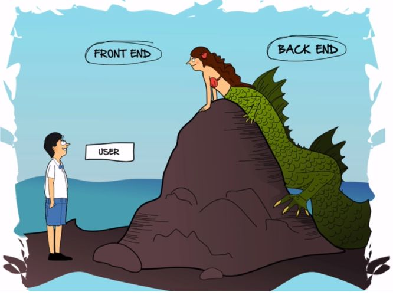
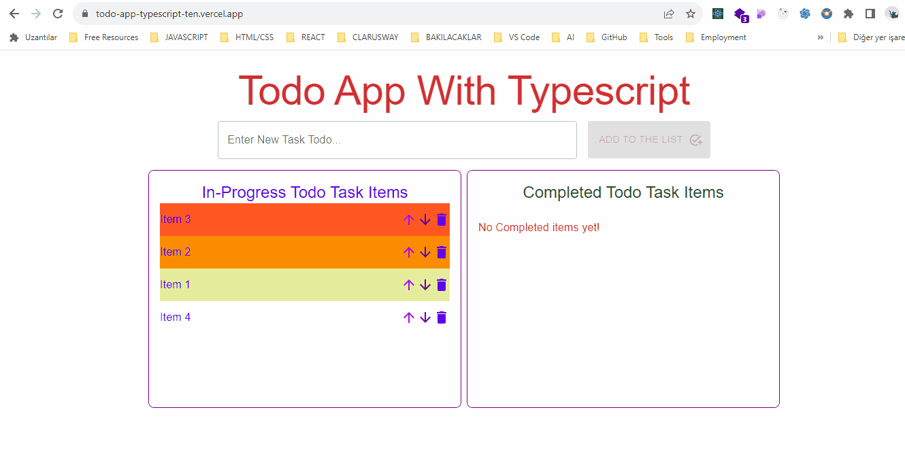
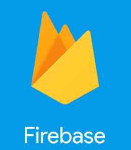

# Welcome to Emrah's GitHub Profile! 👋

<picture>  </picture>

<!--h2 without bottom border-->

  <ul align="left">
    
 <h2 style="display: inline-block">⚡About me⚡</h2>

  </ul>

<h4 style="display: inline-block; align="center"">  Welcome to my GitHub profile! I'm a software developer with a passion for web programming. I'm continuously exploring new technologies and frameworks, always seeking the most effective solutions for the challenges I encounter. 
</h4>

<picture>  </picture>

- I have been improving myself **to become a top-notch FrontEnd Developer**.
- My motto is: **"Keep calm and code on."**
- You can ask me about **React - Javascript - TypeScript - HTML5, CSS3 - Third party CSS libraries**, so that we can discuss and inform each of us about new trends.

### 📬 Connect with me:

  <ul>
    
<h2 style="display: inline-block">⚡Technologies That I Used So Far👨🏻‍💻🌌</h2>

  </ul>

<!--tech stack icons-->

  

  <ul>
    
<h2 style="display: inline-block">My Projects⚒💻</h2>

  </ul>

Here you can find my open-source projects, contributions, and more. Feel free to explore, fork, and contribute to any of my repositories.

### Summary of Languages 📋

### Featured Projects 🚀

| Project Name                                                              | Libraries and Technologies Used                                     | How It Looks                                                                                                                                          | Repo Link                                                         |
| ------------------------------------------------------------------------- | ------------------------------------------------------------------- | ----------------------------------------------------------------------------------------------------------------------------------------------------- | ----------------------------------------------------------------- |
| [Todo List Using Typescript](https://todo-app-typescript-ten.vercel.app/) | TypeScript, React, Vite, Material UI, API, Local State, Sweet Alert | [<picture>  </picture>](https://todo-app-typescript-ten.vercel.app/) | [Repo](https://github.com/emrahugurlu2003/todo-app-typescript)    |
| [Project 2](link-to-project2)                                             | Tech1, Tech2, Tech3                                                 | [Demo](link-to-demo2)                                                                                                                                 | [Repo](link-to-repo2)                                             |
| [Welcome Page Using SASS](https://travel-site-using-sass.vercel.app/)     | SASS, SCSS                                                          | [<picture>  </picture>](https://travel-site-using-sass.vercel.app/)      | [Repo](https://github.com/emrahugurlu2003/Travel-Site-Using-SASS) |
| [Horoscope](https://react-horoscope.vercel.app)                           | React, CRA, SASS, SCSS                                              | [<picture>  </picture>](https://react-horoscope.vercel.app/)                    | [Repo](https://github.com/emrahugurlu2003/react-horoscope)        |

### Technologies I Love 💻

  

<!--  -->

<!--  -->
<!--  -->

<!-- ## GitHub Usage Stats 📊

 -->

<b>🔥 Streak Stats</b>

 
  

<!-- 

<b>🏆 Github Trophies</b>

 

 -->

## Anything Else I Can Help With? 🤔

If you have any questions, want to collaborate on a project, or just want to chat about coding and technology, feel free to [reach out to me](mailto:emrahugurlu2023@gmail.com) or connect with me on [LinkedIn](https://www.linkedin.com/in/emrahugurlu2003/).

**Good luck, and may your code compile on the first try! Happy coding!** 🚀
